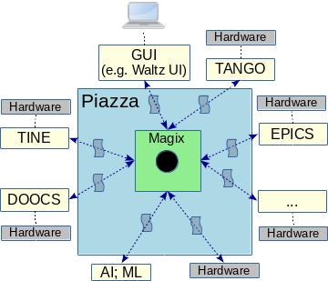

# Magix

The Magix project is a sub-project of Waltz-Controls. Piazza is a federation of connectors governed by the Magix. Magix is a core component that creates a Reactive Stream from a messages flow:

Message is specified in Waltz-Controls RFC1 [[1](https://github.com/waltz-controls/rfc/tree/master/1)]. Every connector (blue arrows in the picture above) SHOULD define its payload in a corresponging RFC.

Here we define all repositories that are related to the Piazza project.

## Magix

Magix is an abstract component. Its API is defined in Waltz-Controls RFC2 [[2](https://github.com/waltz-controls/rfc/tree/master/2)]

Implementations of the Magix component hide underlaying transport from the client e.g. for single-process deployment it can be ZMQ *inproc* etc

Endpoints within piazza exchange messages via Magix. Messages are defined in the corresponding RFCs

**RFCs**

| Platform | Link |
|-|-|
| GitHub| [waltz-controls/RFC](https://github.com/waltz-controls/rfc)|

**Known implementations**

| Platform | State | Transport | URL |
|----------|-------|-----|-----------|
| JavaEE   | Experimental | HTTP/SSE | [waltz-controls/magix-war-plugin](https://github.com/waltz-controls/magix-war-plugin) |
| Kotlin   | Experimental | HTTP/SSE/RSockets | [mipt-npm/controls.kt/magix](https://github.com/mipt-npm/controls.kt/tree/dev/magix) |

**Known client implementations**

| Platform | State | Transport | URL |
|----------|-------|-----|-----------|
| JS6/Browser   | Experimental | HTTP/SSE | [waltz-controls/waltz-magix-plugin](https://github.com/waltz-controls/waltz-magix-plugin) |
| Python 3.6+ | Experimental | HTTP/SSE | [waltz-controls/magix-python-client](https://github.com/waltz-controls/magix-python-client)
| Java 11+ | Experimental | HTTP/SSE | [waltz-controls/magix-java-client](https://github.com/waltz-controls/magix-java-client)

## Connectors

A connector is a component that provides interface between the Magix and upstream endoint(s) e.g. Tango-Controls. Each component MUST define message's *payload* standard that it accepts and sends in Waltz-Controls RFCs

**Known connectors**

| Upstream | Platform | State | Transport | RFC | URL |
|----------|----------|-------|-----|----|-----------|
| Tango-Controls | JavaEE   | Experimental | HTTP/SSE | N/A | [waltz-controls/tango-magix-connector](https://github.com/waltz-controls/magix-tango-connector) |
| Controls.kt | Kotlin   | Experimental | HTTP/SSE/RSockets | N/A | [mipt-npm/controls.kt/controls-magix-client](https://github.com/mipt-npm/controls.kt/tree/dev/controls-magix-client) |
